# DSO202 — Assignment 1: Build Log and Report

This report documents the full process of deploying the three-tier Task Tracker application to a local `kind` Kubernetes cluster, task by task, with the reasoning behind each decision and the issues encountered along the way. See `README.md` for the condensed architecture note, configuration/secrets caveat, ResourceQuota justification, and Task 7 evidence summary required by the assignment brief.

---

## Prerequisites

- Docker Engine or Docker Desktop installed
- `kind` installed
- `kubectl` installed

---

## Stage 1 — Creating the Cluster with `kind`

```
                     host machine (one laptop)
   ┌────────────────────────────────────────────────────────────-───┐
   │  Docker                                                        │
   │                                                                │
   │   ┌───────────────────────┐                                    │
   │   │ container:            │  Kubernetes Node object name:      │
   │   │ dso202-control-plane  │  control-plane                     │
   │   │                       │  runs kube-apiserver, etcd,        │
   │   │                       │  kube-scheduler,                   │
   │   │                       │  kube-controller-manager,          │
   │   │                       │  kubelet, kube-proxy               │
   │   └───────────────────────┘                                    │
   │                                                                │
   │   ┌───────────────────────┐   ┌───────────────────────┐        │
   │   │ container:            │   │ container:            │        │
   │   │ dso202-worker         │   │ dso202-worker2        │        │
   │   │ Node object name:     │   │ Node object name:     │        │
   │   │ worker-node-1         │   │ worker-node-2         │        │
   │   │ runs kubelet,         │   │ runs kubelet,         │        │
   │   │ kube-proxy,           │   │ kube-proxy,           │        │
   │   │ application Pods      │   │ application Pods      │        │
   │   └───────────────────────┘   └───────────────────────┘        │
   │                                                                │
   │   host port 30080  ──►  control-plane container port 30080     │
   └───────────────────────────────────────────────────────────────-┘
```

### Step 1 — Write the cluster config

```bash
cd cluster
touch kind-cluster.yaml
```
*(config content taken from the Practical 1 manifest listing — see `cluster/kind-cluster.yaml`)*

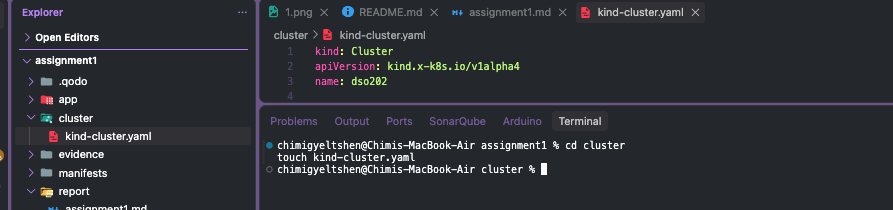

### Step 2 — Create the cluster

```bash
kind create cluster --config cluster/kind-cluster.yaml
```

`--config` points `kind` at the file describing the desired node topology and port mappings; `kind create cluster` builds the cluster accordingly.

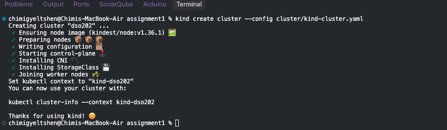
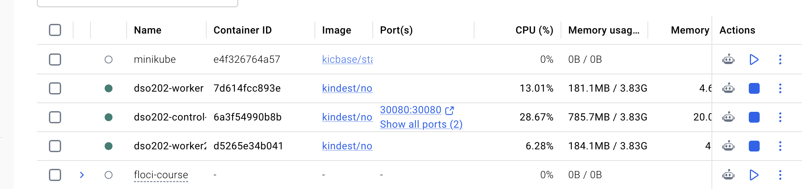

### Step 3 — Confirm the cluster and list its nodes

```bash
kind get clusters
kind get nodes --name <cluster-name>
```

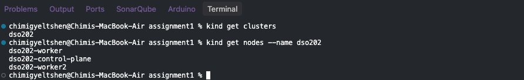

### Step 4 — Inspect the cluster

```bash
kind export kubeconfig --name <cluster-name>   # if needed
kubectl cluster-info
```

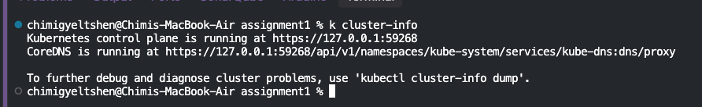

### Step 5 — List all nodes

```bash
kubectl get nodes -o wide
```

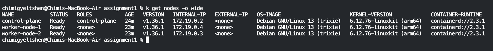

Three nodes are present: `control-plane`, `worker-node-1`, `worker-node-2`.

### Step 6 — List namespaces

```bash
kubectl get namespaces
```

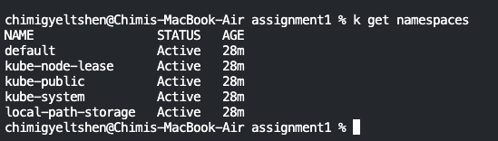

---

## Task 1 — Namespace and Architecture Note

### Why a Dedicated Namespace

A namespace provides a mechanism for isolating a group of resources within a single cluster. Since this assignment creates Deployments, Services, ConfigMaps, Secrets, and a PVC, placing everything in the `default` namespace would mix it with unrelated cluster resources. A dedicated namespace, `dso202-assignment-01`, keeps the assignment's resources isolated and easy to manage as a unit.

### What Goes Into the Namespace

All three application tiers, and every supporting object, live inside `dso202-assignment-01`:

- **Workloads** — Frontend and backend as Deployments; database as a Deployment backed by a PVC.
- **Services** — Cluster-internal network endpoints so components can discover and reach each other (`backend-svc`, `db-svc`, `frontend-svc`).
- **ConfigMaps & Secrets** — Non-sensitive configuration (API URLs, ports) in a ConfigMap; sensitive values (passwords, credentials) in a Secret.
- **PersistentVolumeClaims** — Used by the database to request persistent storage so data survives container restarts.

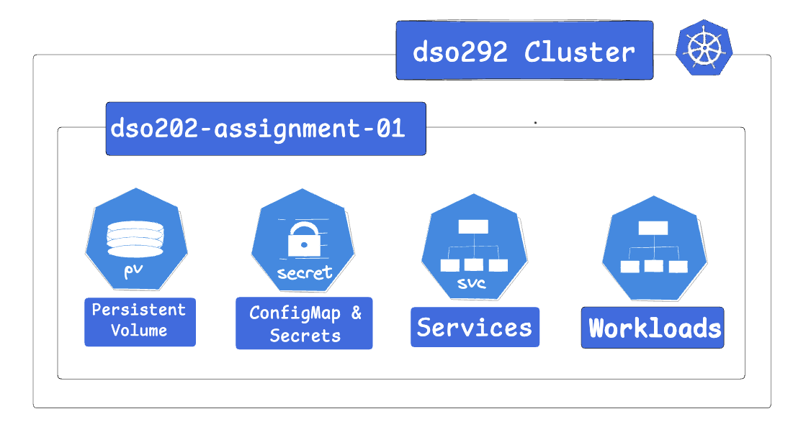

### Creating the Namespace

```bash
cd common-manifests
touch namespace.yaml
# define the namespace object in namespace.yaml
```

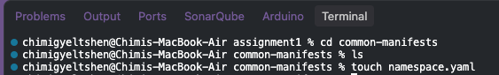
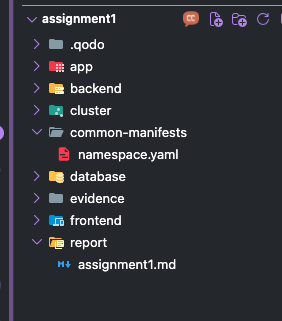

```bash
kubectl apply -f common-manifests/namespace.yaml
```


**Verify:**

```bash
kubectl get namespaces
kubectl describe namespace dso202-assignment-01
```

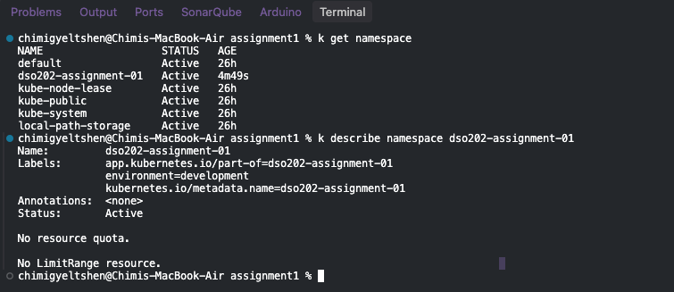

### About Namespaces

A namespace is a logical partition — a virtual cluster inside a physical cluster — and does not have its own control plane or scheduler. All three tiers live in one namespace so their Services can find each other by a short DNS name.

**Where does a namespace live — inside or outside a node?** Neither. Nodes and namespaces are both cluster-scoped resources, but namespaces are not tied to any specific node. They provide a way to organize and manage resources across the entire cluster, regardless of which node the underlying Pods are scheduled to.

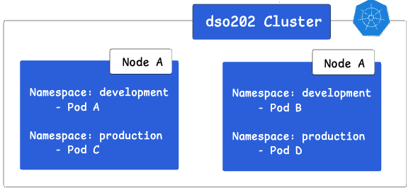

### What Happens on the Control Plane for Every Pod

Regardless of tier, the same control-plane components act on every Pod created:

1. **`kube-apiserver`** — receives the `kubectl apply`, validates the object against the schema, and writes it to `etcd`. Every read/write in the cluster passes through this component.
2. **`etcd`** — persists the desired state (the manifest) as the cluster's source of truth.
3. **`kube-scheduler`** — watches for unscheduled Pods, evaluates the two worker nodes against resource requests/limits, taints/tolerations, and affinity rules, and binds the Pod to one of them.

The control plane's job is entirely about **deciding and recording** — it never runs containers itself.

### What Happens on the Worker Node That Gets Picked

Once the scheduler assigns a Pod to `worker-node-1` or `worker-node-2`:

1. **`kubelet`** on that node watches the API server for Pods bound to it, pulls the image via the container runtime (`containerd`, inside `kind`'s node image), and starts the container(s).
2. **`kube-proxy`** programs iptables/IPVS rules so traffic sent to a Service's ClusterIP is forwarded to the correct Pod IP, wherever it's actually running.
3. **The CNI plugin** (`kindnet`, by default) assigns the Pod an IP from the pod subnet (`10.244.0.0/16`) and wires up networking so Pods can reach each other across nodes.

### Object Choice per Tier

| Tier | Object | Why |
| --- | --- | --- |
| **Frontend** (static HTML/CSS/JS via nginx) | `Deployment` | Stateless, interchangeable replicas — any replacement Pod is identical. Exposed via a `NodePort` Service wired to host port `30080`. |
| **Backend** (Express-style REST API) | `Deployment` | Stateless as long as it holds no local session state — each replica handles any request identically, delegating persistence to Postgres. Exposed internally via a `ClusterIP` Service. |
| **Database** (PostgreSQL) | `Deployment` + `PersistentVolumeClaim` | A single-replica Deployment scoped to this assignment's requirements, with a PVC decoupling data lifecycle from Pod lifecycle. Exposed via a **headless** Service (`clusterIP: None`) so the backend addresses it by a stable DNS name rather than a load-balanced virtual IP. |

### Supporting Objects (Independent of the Three Pods)

| Object | Purpose |
| --- | --- |
| **Secret** | Database credentials (`POSTGRES_PASSWORD`, etc.) — never placed in a ConfigMap. |
| **ConfigMap** | Non-secret configuration such as `DB_HOST`, `DB_PORT`, and feature/runtime flags. |
| **PersistentVolumeClaim** | Backed by `kind`'s default `standard` StorageClass, which provisions `hostPath`-based volumes on the node. |

---

## Task 2 — Configuration and Secrets

### ConfigMap

A ConfigMap is an API object for storing non-confidential data as key-value pairs. Pods can consume it as environment variables, command-line arguments, or mounted configuration files.

Typical ConfigMap contents include:
- Database connection details excluding passwords (`DATABASE_HOST`, `DATABASE_PORT`, etc.)
- Feature flags (e.g. `ENABLE_NEW_DASHBOARD: "true"`)
- Logging settings (`LOG_LEVEL`, `LOG_OUTPUT`)
- Application mode and ports (`APP_ENV`, `PORT`)

**Caution:** a ConfigMap provides no secrecy or encryption. It is a namespaced object.

**Keys included in this assignment's ConfigMap:**

| Key | Example value | Notes |
| --- | --- | --- |
| `DB_HOST` | `db-svc` | Must match the database Service's name |
| `DB_PORT` | `5432` | Postgres default |
| `DB_NAME` | `taskdb` | Must be identical to `POSTGRES_DB` |
| `APP_PORT` | `8080` | Backend's internal port |
| `CORS_ORIGIN` | `*` | Permissive per spec |
| `POSTGRES_DB` | `taskdb` | Same value as `DB_NAME` — the official Postgres image reads this specific key name |
| `BACKEND_URL` | `http://backend-svc:8080` | Consumed by the frontend; must point to the backend Service name |

#### Step 1 — Create the manifest

```bash
cd common-manifests
touch configmap.yaml
```
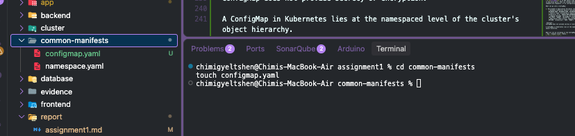

#### Step 2 — Apply and verify

```bash
kubectl apply -f configmap.yaml -n dso202-assignment-01
kubectl get configmap -n dso202-assignment-01
kubectl get configmap app-config -n dso202-assignment-01 -o yaml
```
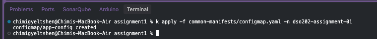
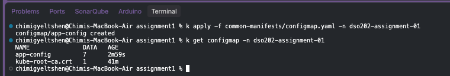
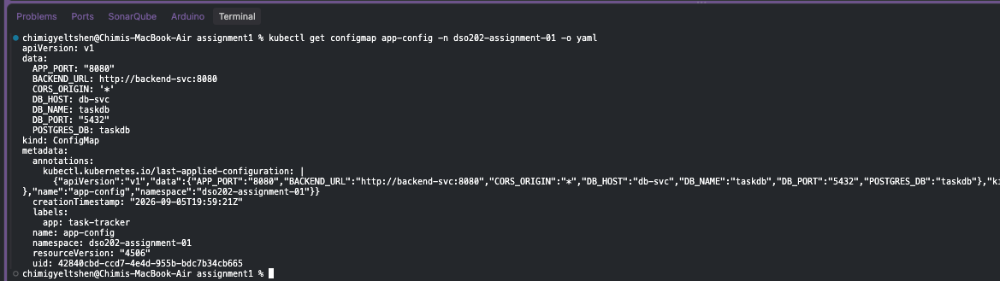

### Secrets

A Secret stores a small amount of sensitive data — a password, token, or key.

**Caution:** Kubernetes Secrets are, by default, stored **unencrypted** in `etcd`. Anyone with API access, or access to `etcd` directly, can retrieve or modify a Secret. Anyone authorized to create a Pod in a namespace can indirectly read any Secret in that namespace (e.g. by creating a Deployment that mounts it).

To use Secrets safely in a real deployment, at minimum:
1. Enable encryption at rest for Secrets.
2. Configure RBAC with least-privilege access to Secrets.
3. Restrict Secret access to specific containers.
4. Consider an external secret store provider.

Secrets are commonly used to:
- Set environment variables for a container.
- Provide credentials such as SSH keys or passwords to Pods.
- Allow the kubelet to pull images from private registries.

#### Step 1 — Create the manifest

```bash
cd common-manifests
touch secret.yaml
```
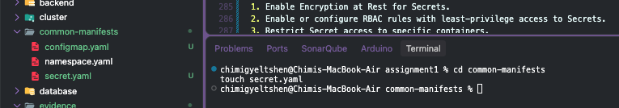

#### Step 2 — Apply and verify

```bash
kubectl apply -f common-manifests/secret.yaml -n dso202-assignment-01
kubectl get secret app-secret -n dso202-assignment-01 -o yaml
kubectl get secret -n dso202-assignment-01
```
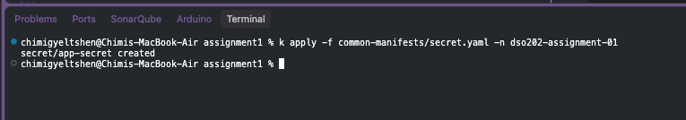
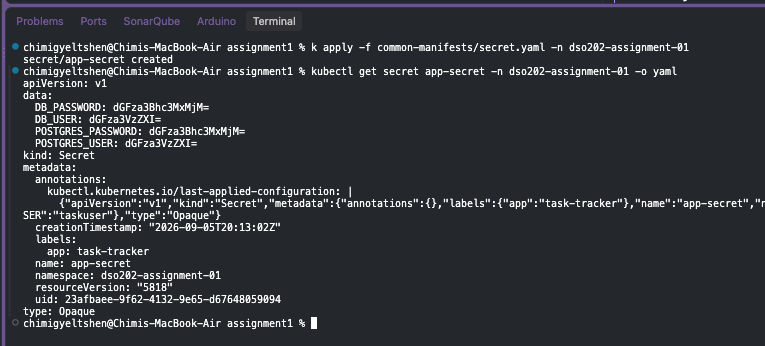
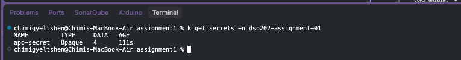

---

## Task 3 — Database Tier

### PersistentVolumeClaim

#### Step 1 — Create the PVC manifest

```bash
cd database
touch pvc.yaml
```
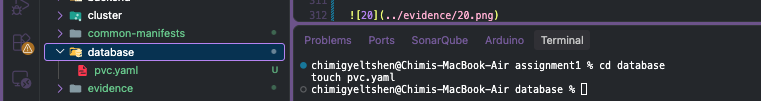

#### Step 2 — Apply

```bash
kubectl apply -f database/pvc.yaml
```
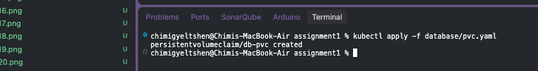

### Deployment (PostgreSQL)

#### Step 1 — Create the Deployment manifest

```bash
cd database
touch deployment.yaml
```
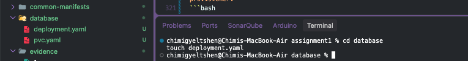

#### Step 2 — Apply

```bash
kubectl apply -f database/deployment.yaml -n dso202-assignment-01
```
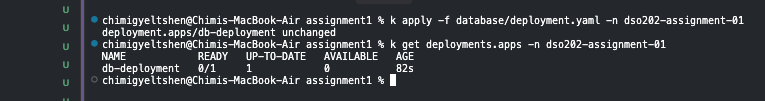

### Headless Service

#### Step 1 — Create the Service manifest

```bash
cd database
touch service.yaml
```
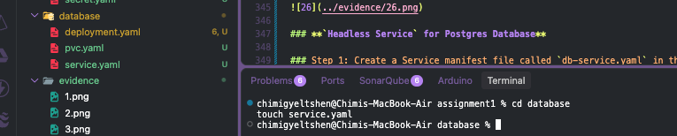

#### Step 2 — Apply

```bash
kubectl apply -f database/service.yaml -n dso202-assignment-01
```
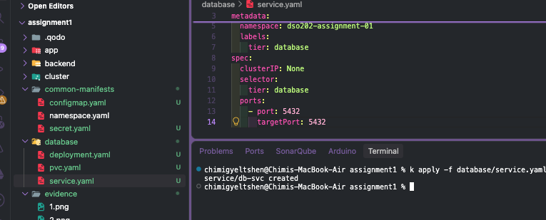

### Verification

```bash
kubectl get pvc -n dso202-assignment-01
kubectl get pods -n dso202-assignment-01 -l tier=database
kubectl get svc -n dso202-assignment-01
```
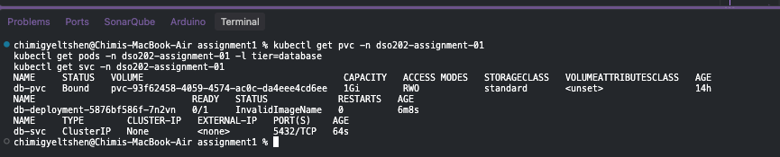

### What This Achieves

Three pieces work together here:

1. **The PVC** is a request for storage — "I need 1GB of disk space." On its own, it does nothing but wait in `Pending`.
2. **The Deployment** creates and manages the database Pod: it runs the Postgres image, injects `POSTGRES_DB` / `POSTGRES_USER` / `POSTGRES_PASSWORD` from the ConfigMap/Secret (never hardcoded), and mounts the PVC's storage at `/var/lib/postgresql/data`.
3. **The headless Service** gives the database a stable name (`db-svc`) inside the cluster, so the backend can find it by name rather than by IP — which changes every time a Pod restarts. "Headless" means the Service points directly at the one Pod rather than load-balancing across many, appropriate for a single-instance database.

**Sequence of events:**

1. The PVC is applied first and sits `Pending` — an unfulfilled reservation.
2. The Deployment is applied, and Kubernetes creates a Pod running Postgres.
3. Once that Pod is scheduled onto a node, Kubernetes provisions real disk space and binds it to the PVC — the reservation is fulfilled.
4. Postgres starts inside the container, reads the injected environment variables, and initializes itself accordingly.
5. Postgres writes its data to `/var/lib/postgresql/data`, which is actually the PVC's disk space mounted at that path — not the container's own writable layer.
6. The headless Service watches for any Pod labeled `tier: database` and makes it reachable at `db-svc` — so the backend can later connect to `db-svc:5432` without knowing any Pod IP.

**Why this matters:** the Pod and the data are two separate things. If the database Pod is deleted, the Deployment's controller creates a fresh replacement Pod — but that new Pod mounts the *same* PVC, so it sees the same data. The container is disposable; the data is not. This is exactly what Task 7c later demonstrates.

---

## Task 4 — Backend Tier

Sequence: Deployment → ClusterIP Service → ConfigMap/Secret injection → verify API endpoints.

### Deployment

#### Step 1 — Create the manifest

```bash
cd backend
touch deployment.yaml
```
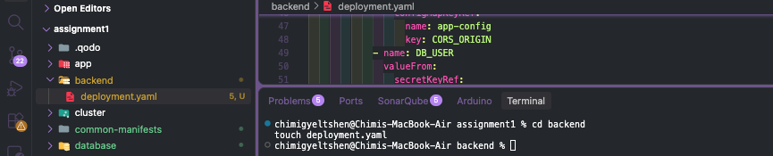

#### Step 2 — Apply

```bash
kubectl apply -f backend/deployment.yaml -n dso202-assignment-01
```
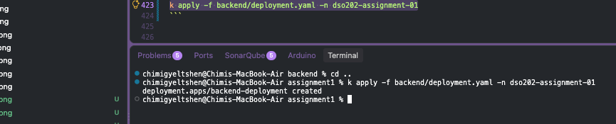

### Service

#### Step 1 — Create the manifest

```bash
cd backend
touch service.yaml
```
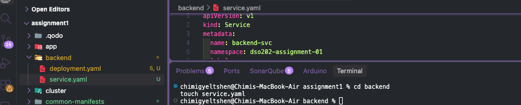

#### Step 2 — Apply

```bash
kubectl apply -f backend/service.yaml -n dso202-assignment-01
```
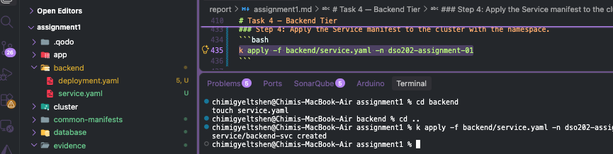

### Verification

```bash
kubectl get pods -n dso202-assignment-01 -l tier=backend
kubectl get svc -n dso202-assignment-01
kubectl logs -n dso202-assignment-01 -l tier=backend
```
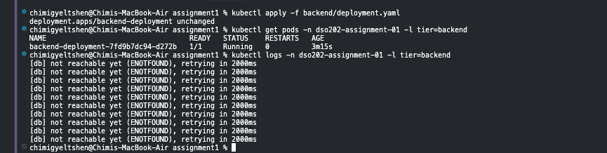

### Issue Encountered: `ENOTFOUND` on Startup

The backend logs initially showed repeated `[db] not reachable yet (ENOTFOUND), retrying in 2000ms` messages. This meant the backend could not resolve the hostname `db-svc` via DNS — a Task 3 dependency issue, not a bug in the backend's retry logic (which was working exactly as designed).

**Debugging sequence:**

1. Checked whether `db-svc` existed:
   ```bash
   kubectl get svc -n dso202-assignment-01
   ```
   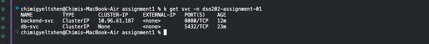
   `db-svc` was present and correctly headless — so the Service object itself was fine. The problem was either no Pod behind it, or a label mismatch.

2. Checked the Pods in the namespace:
   ```bash
   kubectl get pods -n dso202-assignment-01
   ```
   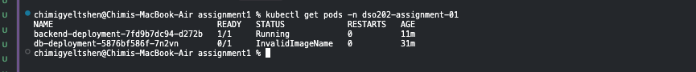

   Both the backend and database Deployments had a literal `<tag>` placeholder left in their `image:` field instead of the real version tag, producing `InvalidImageName`. The actual published tag for all three images (confirmed via Docker Hub) was `1.0`.

3. After correcting the image tags to `sarojsanyasi/dso202-backend:1.0` and `sarojsanyasi/dso202-db:1.0` and reapplying, both Pods reached `Running`:
   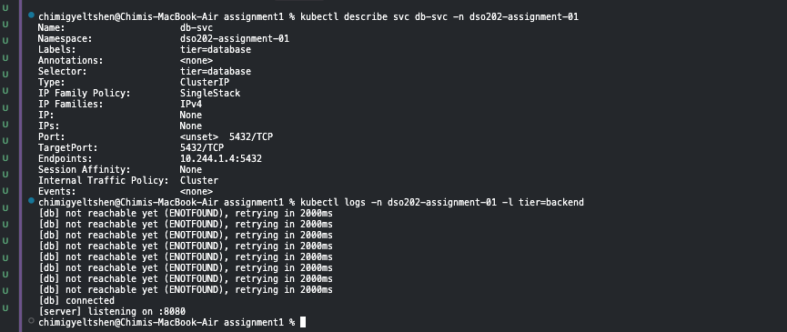

### Confirming End-to-End Wiring

With both Pods running, the full chain — ConfigMap/Secret → backend env vars → `db-svc` DNS resolution → live database connection — was verified:

```bash
kubectl exec -n dso202-assignment-01 -it backend-deployment-7fd9b7dc94-d272b -- wget -qO- localhost:8080/api/status
```
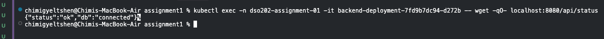

Response: `{"status":"ok","db":"connected"}`

### Lessons for Avoiding This in Future

- Check Pods immediately after every `apply` — don't assume success just because `kubectl apply` returned without error.
- When something can't connect, work backward through the chain systematically: Service → Endpoints → Pod status → container logs → image validity.
- Use `kubectl describe` before `kubectl logs` when a Pod isn't `Running` — a Pod that never started has no logs to read, but `describe`'s Events section usually shows the cause immediately.

---

## Task 5 — Frontend Tier

### Deployment

#### Step 1 — Create the manifest

```bash
cd frontend
touch deployment.yaml
```
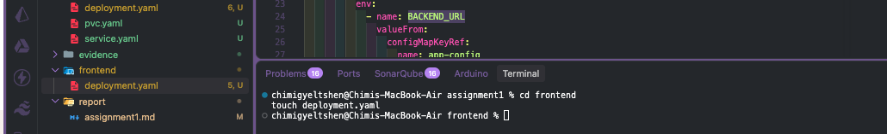

#### Step 2 — Apply

```bash
kubectl apply -f frontend/deployment.yaml -n dso202-assignment-01
```
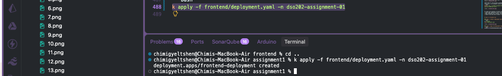

This tier is simpler than the backend/database — the frontend only needs one environment variable, `BACKEND_URL`, already present in the ConfigMap as `http://backend-svc:8080`.

### Service

#### Step 1 — Create the manifest

```bash
cd frontend
touch service.yaml
```
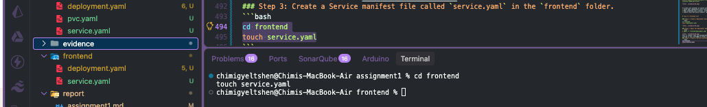

#### Step 2 — Apply

```bash
kubectl apply -f frontend/service.yaml -n dso202-assignment-01
```
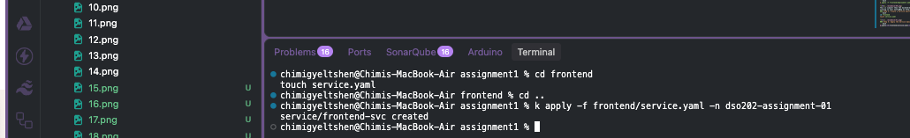

### Verification

```bash
kubectl get pods -n dso202-assignment-01 -l tier=frontend
kubectl get svc -n dso202-assignment-01
```
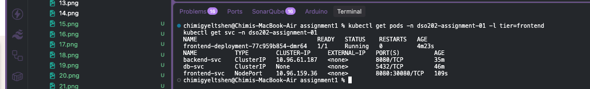
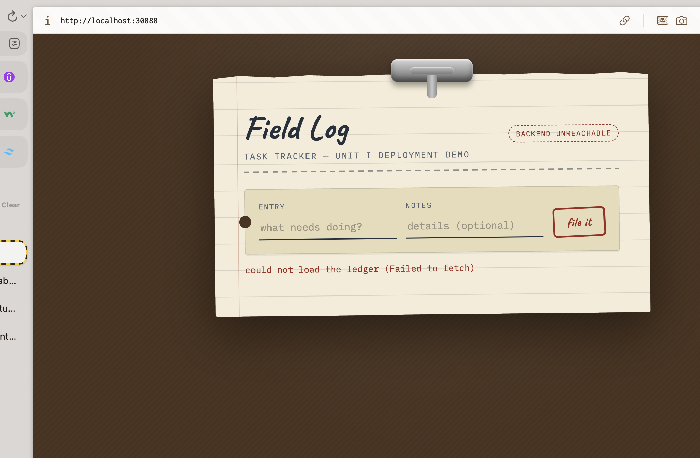

The frontend was confirmed reachable at `http://localhost:30080`, since the `kind` cluster's `dso202-control-plane` container already had host port `30080` mapped to container port `30080`.

---

## Task 6 — Namespace Resource Governance

A ResourceQuota (caps total consumption across the namespace) and a LimitRange (sets default/min/max per container) were applied together in a single manifest.

### Step 1 — Create the manifest

```bash
cd common-manifests
touch quota.yaml
```
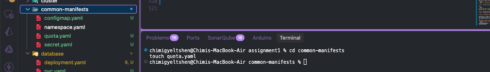

### Step 2 — Apply

```bash
kubectl apply -f common-manifests/quota.yaml -n dso202-assignment-01
```
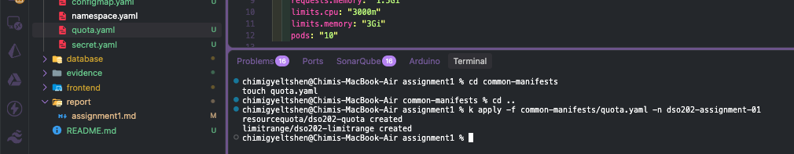

### Verification

```bash
kubectl describe resourcequota dso202-quota -n dso202-assignment-01
kubectl describe limitrange dso202-limitrange -n dso202-assignment-01
```
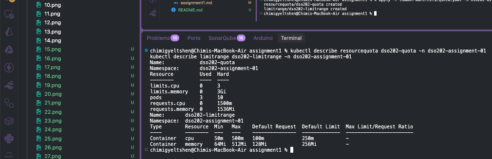

See `README.md` for the full justification of the chosen values.

---

## Task 7 — Verification and Interactivity

### 7a — Full CRUD Cycle

An initial attempt through the browser produced no clear error in the Network tab, so verification was performed via `curl` against a port-forwarded backend instead — an approach explicitly permitted by the assignment brief.

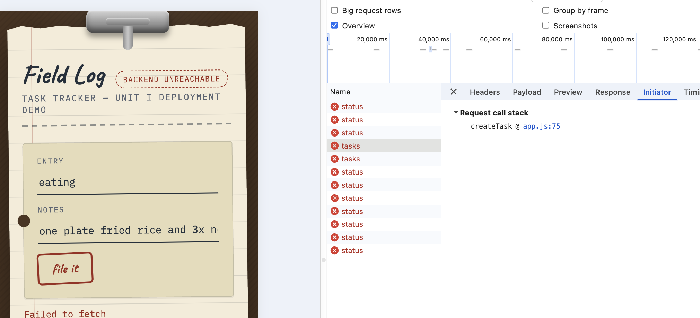

```bash
kubectl port-forward -n dso202-assignment-01 svc/backend-svc 8080:8080
```
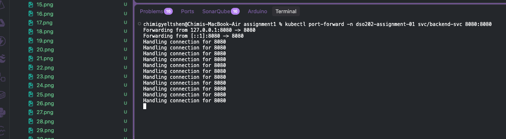

```bash
curl -s -X POST localhost:8080/api/tasks -H "Content-Type: application/json" -d '{"title":"Test task","description":"CRUD check"}'
curl -s localhost:8080/api/tasks
curl -s -X PUT localhost:8080/api/tasks/1 -H "Content-Type: application/json" -d '{"status":"in_progress"}'
curl -s localhost:8080/api/tasks/1
curl -s -X DELETE localhost:8080/api/tasks/1
curl -s localhost:8080/api/tasks
```
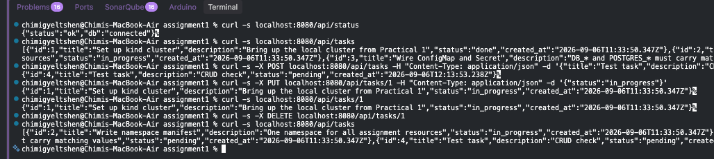
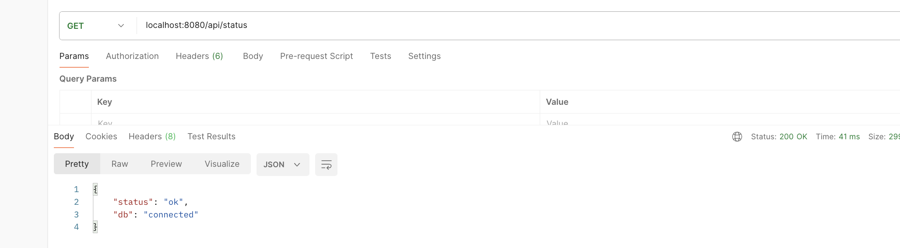

All five operations (create, list, retrieve, update, delete) completed successfully.

**Note on the browser attempt:** `BACKEND_URL` is baked into the frontend's `config.js` at container start and read by client-side JavaScript running in the browser. Since `backend-svc` is a cluster-internal DNS name, it cannot be resolved by a browser running on the host machine outside the cluster network — this is a structural characteristic of the architecture, not a misconfiguration, which is why the brief explicitly allows verification via a port-forwarded `curl` path.

### 7b — Service DNS Resolution

Confirms that cluster DNS resolves `backend-svc` by name from inside another Pod.

```bash
kubectl get pods -n dso202-assignment-01 -l tier=frontend
```


```bash
kubectl exec -n dso202-assignment-01 -it frontend-deployment-77c959b854-dmr64 -- curl -s http://backend-svc:8080/api/status
```
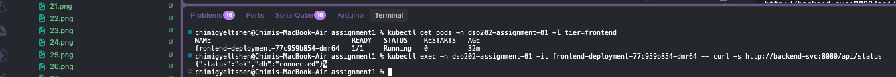

The request succeeded, confirming the frontend Pod resolved `backend-svc` via cluster DNS and reached the backend without any hardcoded IP address.

### 7c — Self-Healing and Data Persistence

**Step 1 — Create a task to track through the deletion:**
```bash
curl -s -X POST localhost:8080/api/tasks -H "Content-Type: application/json" -d '{"title":"Persistence check","description":"survives pod deletion"}'
```


**Step 2 — Watch Pods in a separate terminal:**
```bash
kubectl get pods -n dso202-assignment-01 --watch
```


**Step 3 — Delete the backend Pod:**
```bash
kubectl delete pod -n dso202-assignment-01 -l tier=backend
```


The watch output showed the original Pod terminate and a new Pod (a different ReplicaSet hash suffix) reach `Running`. The task created in Step 1 remained retrievable through the new Pod, confirming that the database's PersistentVolumeClaim — not the backend's ephemeral container filesystem — is what preserves data across Pod recreation. Pod lifecycle and data lifecycle are independent.

### 7d — Declarative vs. Imperative Comparison

An initial attempt used `kubectl delete -f common-manifests/quota.yaml`, which removed both the ResourceQuota and LimitRange objects defined in that file:

```bash
kubectl delete -f common-manifests/quota.yaml
```


Since that approach affects two real resources at once, a cleaner comparison was made using a throwaway ConfigMap instead, so the actual `app-config` object was never touched:

```bash
kubectl create configmap demo-config --from-literal=DEMO_KEY=demo-value -n dso202-assignment-01
kubectl get configmap demo-config -n dso202-assignment-01 -o yaml
kubectl delete configmap demo-config -n dso202-assignment-01
```


**Comparison:** the declarative approach (`kubectl apply -f`, used for every real object in this project) is repeatable and idempotent — reapplying the same file causes no unwanted side effects, and the YAML itself is a version-controlled, reviewable source of truth. The imperative approach (`kubectl create ...`) is faster for one-off or exploratory tasks, but leaves no record in version control and is harder to reproduce exactly later. In practice, declarative management is the right default for anything meant to persist or be audited; imperative commands are best reserved for quick, disposable debugging — which is exactly why this project's real resources are all defined as YAML files rather than created ad hoc.

---

## Task 8 — Bonus RBAC

Not attempted for this submission (optional, per the assignment brief).

---

## Summary of Issues Encountered and Fixes

| Issue | Root Cause | Fix |
| --- | --- | --- |
| `InvalidImageName` on backend and database Pods | Literal `<tag>` placeholder left in `image:` field | Replaced with the actual published tag (`1.0`), confirmed via Docker Hub |
| `ENOTFOUND` in backend logs | Database Pod not yet running (due to the image tag issue above), so `db-svc` had no Endpoints | Fixed the database Deployment's image tag; backend's retry/backoff logic then connected automatically |
| `curl: executable file not found` inside a Pod | Minimal runtime images intentionally omit debugging tools like `curl` | Used `wget` where available, or `kubectl port-forward` plus `curl` from the host machine |
| Browser could not reach `backend-svc` | Cluster-internal DNS names are not resolvable outside the cluster network | Verified CRUD operations via `curl` through a port-forwarded backend Service instead, per the brief's explicit allowance |