# Assignment 2 — StatefulSet and Ingress

## Table of Contents

1. [Objectives](#1-objectives)
2. [Starting Point (Assignment 1)](#2-starting-point-assignment-1)
3. [Environment Check: Loss of the Assignment 1 Namespace](#3-environment-check-loss-of-the-assignment-1-namespace)
4. [Part 1 — Migrating the Database to a StatefulSet](#4-part-1--migrating-the-database-to-a-statefulset)
5. [Part 2 — Ingress with the NGINX Ingress Controller](#5-part-2--ingress-with-the-nginx-ingress-controller)
6. [Summary of Changes](#6-summary-of-changes)
7. [Observations and Future Work](#7-observations-and-future-work)

---

## 1. Objectives

This assignment extends the three-tier Task Tracker application (PostgreSQL → Express backend → NGINX-served frontend) deployed in Assignment 1. It makes two improvements:

| Part | Change | Goal |
|---|---|---|
| 1 | Replace the database `Deployment` + standalone `PVC` with a **StatefulSet** | Give the database a stable identity and let Kubernetes manage its storage |
| 2 | Replace the frontend `NodePort` with an **Ingress** served by the NGINX Ingress Controller | Provide a single HTTP entry point so the browser can reach both the frontend and the backend API |

---

## 2. Starting Point (Assignment 1)

At the end of Assignment 1, the following was deployed in namespace `dso202-assignment-01` on a `kind` cluster named `dso202`:

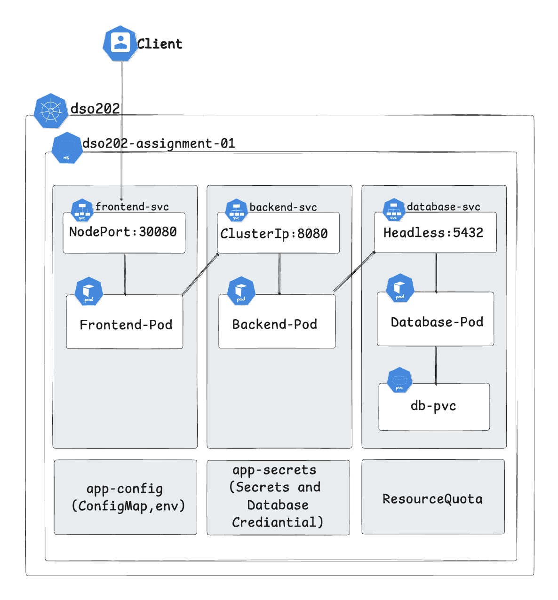

*Figure 1 — State of the cluster at the end of Assignment 1.*

```
cluster/kind-cluster.yaml          ← kind cluster: 1 control-plane + 2 workers
                                      host port 30080 → node port 30080 (only mapping)

common-manifests/
  namespace.yaml                   ← Namespace: dso202-assignment-01
  configmap.yaml                   ← app-config (DB_HOST="db-svc", BACKEND_URL="http://backend-svc:8080")
  secret.yaml                      ← app-secret (DB credentials, base64-encoded)
  quota.yaml                       ← ResourceQuota + LimitRange

database/
  pvc.yaml                         ← PersistentVolumeClaim: db-pvc (1Gi, ReadWriteOnce)
  deployment.yaml                  ← Deployment: db-deployment (postgres, mounts db-pvc)
  service.yaml                     ← Headless Service: db-svc (clusterIP: None)

backend/
  deployment.yaml                  ← Deployment: backend-deployment (1 replica)
  service.yaml                     ← ClusterIP Service: backend-svc (port 8080)

frontend/
  deployment.yaml                  ← Deployment: frontend-deployment (1 replica)
  service.yaml                     ← NodePort Service: frontend-svc (nodePort 30080)
```

### Known limitations

| Limitation | Root cause |
|---|---|
| The database Pod gets a random name (e.g. `db-deployment-7fd9b7dc94-d272b`) every time it is recreated | A `Deployment` treats Pods as interchangeable and gives them no stable identity |
| Database storage is a separately created `PVC`, so two objects must be managed together | A `Deployment` cannot create or own storage for its Pods |
| The frontend is only reachable through a raw `NodePort` at `http://localhost:30080` | There is no Ingress layer, and only one port is mapped from the host into the cluster |
| Browser JavaScript cannot reach `backend-svc:8080` | `BACKEND_URL` is a cluster-internal DNS name, which cannot be resolved by a browser running outside the cluster |
| Frontend and backend have no single, clean HTTP entry point | Each tier uses its own exposure mechanism |

---

## 3. Environment Check: Loss of the Assignment 1 Namespace

### 3.1 What was observed

Before making any changes, the existing ConfigMaps were listed:

```bash
kubectl get configmaps -n dso202-assignment-01
```

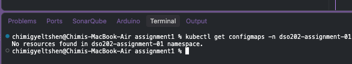

*Figure 2 — The application ConfigMap is missing.*

Further checks showed that the cluster itself still existed and its nodes were healthy (18 days old), but the `dso202-assignment-01` namespace and everything inside it were gone.

```bash
kind get clusters
```

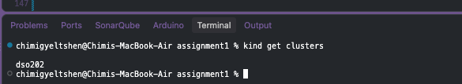

*Figure 3 — The `dso202` cluster is still registered.*

```bash
kubectl get nodes
```

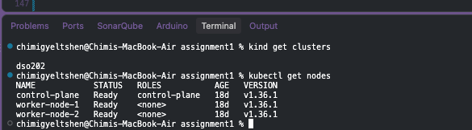

*Figure 4 — All three nodes are `Ready`.*

```bash
kubectl get namespaces
```

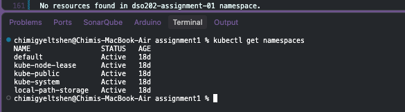

*Figure 5 — `dso202-assignment-01` is no longer listed.*

```bash
kubectl get all -n dso202-assignment-01
```

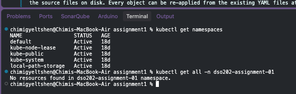

*Figure 6 — `No resources found in dso202-assignment-01 namespace.`*

### 3.2 Cause

After Assignment 1 was completed, Docker Engine was stopped. Every node of a `kind` cluster is a Docker container, so stopping Docker stopped the whole cluster. When Docker was started again, the node containers came back, but the Kubernetes objects stored in the cluster's `etcd` (the namespace, Deployments, Services, ConfigMap, Secret and PVC) were no longer present.

`kind` is designed for short-lived development and test clusters. It does not guarantee that cluster state survives a Docker restart, so this outcome is a known limitation of the tool rather than an application fault.

### 3.3 Why this was not a problem

All manifests are kept as YAML files under version control in this repository. Only the **live cluster state** was lost; the **declared state** on disk was untouched. Every object could therefore be recreated with `kubectl apply`, which is exactly the benefit of the declarative, file-based approach used since Assignment 1.

Because the old objects no longer existed, there was nothing to delete before applying the new manifests in Part 1.

---

## 4. Part 1 — Migrating the Database to a StatefulSet

### 4.1 Why a StatefulSet

A `Deployment` is designed for stateless, interchangeable Pods. A **StatefulSet** is the Kubernetes workload designed for stateful applications such as databases.

| Property | `Deployment` (Assignment 1) | `StatefulSet` (Assignment 2) |
|---|---|---|
| Pod naming | Random suffix, e.g. `db-deployment-7fd9b7dc94-d272b` | Stable ordinal names: `db-0`, `db-1`, … |
| Per-Pod DNS | No stable per-Pod DNS name | `db-0.db-svc.dso202-assignment-01.svc.cluster.local`, unchanged across restarts |
| Storage | A separate `PVC` created and referenced manually | `volumeClaimTemplates`: Kubernetes creates one PVC per Pod and keeps it bound to that Pod |
| Start-up order | All Pods start in parallel | Ordered: `db-0` must be Running and Ready before `db-1` is created |
| Scale-down order | Any order | Reverse ordinal order: `db-1` is removed before `db-0` |

For PostgreSQL this means:

- The Pod is always called `db-0`, even after a crash or rescheduling, so the backend can use the stable DNS name `db-0.db-svc` instead of an IP address.
- If more replicas are added later, `db-0` always starts first. Note that scaling a StatefulSet does **not** by itself set up PostgreSQL replication; that would require additional configuration (for example, streaming replication or an operator).

### 4.2 Planned changes

| Action | File |
|---|---|
| **Retire** | `database/deployment.yaml` — replaced by the StatefulSet (no longer applied) |
| **Retire** | `database/pvc.yaml` — replaced by `volumeClaimTemplates` (no longer applied) |
| **Create** | `database/statefulset.yaml` |
| **Update** | `common-manifests/configmap.yaml` — `DB_HOST` changes from `db-svc` to `db-0.db-svc` |
| Keep | `database/service.yaml` — the headless Service is reused and referenced by the StatefulSet's `serviceName` |

### 4.3 Step 1 — Update the ConfigMap

The StatefulSet Pod is reachable at `db-0.db-svc` (Pod `db-0` behind the headless Service `db-svc`). `DB_HOST` is updated to use this stable per-Pod identity.

**File: `common-manifests/configmap.yaml`**

```yaml
apiVersion: v1
kind: ConfigMap
metadata:
  name: app-config
  namespace: dso202-assignment-01
  labels:
    app: task-tracker
data:
  DB_HOST: "db-0.db-svc"          # was "db-svc"
  DB_PORT: "5432"
  DB_NAME: "taskdb"
  APP_PORT: "8080"
  CORS_ORIGIN: "*"
  POSTGRES_DB: "taskdb"
  BACKEND_URL: "http://backend-svc:8080"
```

> **Why `db-0.db-svc` instead of `db-svc`?**
> With a single replica, the headless Service name `db-svc` would still resolve to the database Pod and would keep working. Using `db-0.db-svc` explicitly relies on the StatefulSet's key feature, a stable per-Pod DNS identity, and it will keep pointing at the primary (`db-0`) if replicas are added later.

### 4.4 Step 2 — Recreate the namespace and supporting objects

Because the namespace was lost (Section 3), it is recreated first, together with the Secret and the quota objects:

```bash
kubectl apply -f common-manifests/namespace.yaml
kubectl apply -f common-manifests/secret.yaml
kubectl apply -f common-manifests/quota.yaml
```

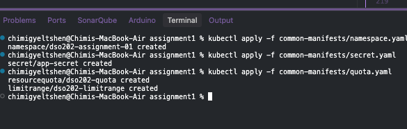

*Figure 7 — Namespace, Secret, ResourceQuota and LimitRange created.*

Then the updated ConfigMap is applied and checked:

```bash
kubectl apply -f common-manifests/configmap.yaml
kubectl get configmaps -n dso202-assignment-01
```

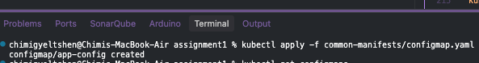

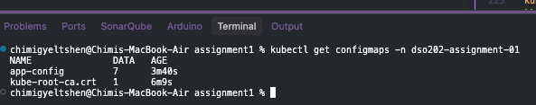

*Figures 8–9 — `app-config` created and present in the namespace.*

### 4.5 Step 3 — Create the StatefulSet manifest

**File: `database/statefulset.yaml`**

```yaml
apiVersion: apps/v1
kind: StatefulSet
metadata:
  name: db
  namespace: dso202-assignment-01
  labels:
    tier: database
spec:
  serviceName: "db-svc"
  replicas: 1
  selector:
    matchLabels:
      tier: database
  template:
    metadata:
      labels:
        tier: database
    spec:
      containers:
        - name: db
          image: sarojsanyasi/dso202-db:1.0
          ports:
            - containerPort: 5432
          env:
            - name: POSTGRES_DB
              valueFrom:
                configMapKeyRef:
                  name: app-config
                  key: POSTGRES_DB
            - name: POSTGRES_USER
              valueFrom:
                secretKeyRef:
                  name: app-secret
                  key: POSTGRES_USER
            - name: POSTGRES_PASSWORD
              valueFrom:
                secretKeyRef:
                  name: app-secret
                  key: POSTGRES_PASSWORD
          volumeMounts:
            - name: db-storage
              mountPath: /var/lib/postgresql/data
  volumeClaimTemplates:
    - metadata:
        name: db-storage
      spec:
        accessModes:
          - ReadWriteOnce
        resources:
          requests:
            storage: 1Gi
```

**Key fields:**

- **`serviceName: "db-svc"`** — must match the name of the existing headless Service. This is what gives the Pod its stable DNS name `db-0.db-svc`.
- **`volumeClaimTemplates`** — replaces `database/pvc.yaml`. Kubernetes automatically creates a PVC named `<template>-<pod>`, i.e. `db-storage-db-0`, and binds it to Pod `db-0`. The PVC is **not** deleted when the Pod is deleted or rescheduled, so the data survives Pod restarts.
- **Pod template** — the container image, environment variables and volume mount are the same as in the old `database/deployment.yaml`; only the controlling object type changes.

### 4.6 Step 4 — Apply the database tier

The headless Service is applied first, because the StatefulSet refers to it through `serviceName`. The Service manifest is unchanged from Assignment 1.

```bash
kubectl apply -f database/service.yaml
kubectl apply -f database/statefulset.yaml
```

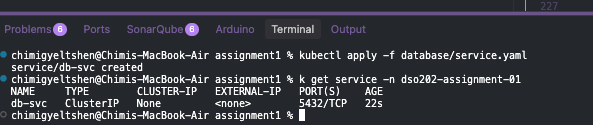

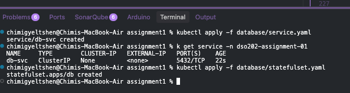

*Figures 10–11 — Headless Service and StatefulSet created.*

### 4.7 Step 5 — Verify the StatefulSet

```bash
# StatefulSet exists and is ready
kubectl get statefulset -n dso202-assignment-01

# The Pod has the stable name db-0
kubectl get pods -n dso202-assignment-01 -l tier=database

# The PVC db-storage-db-0 was created automatically
kubectl get pvc -n dso202-assignment-01

# The headless Service exists and has an endpoint
kubectl get svc db-svc -n dso202-assignment-01
kubectl get endpoints db-svc -n dso202-assignment-01
```

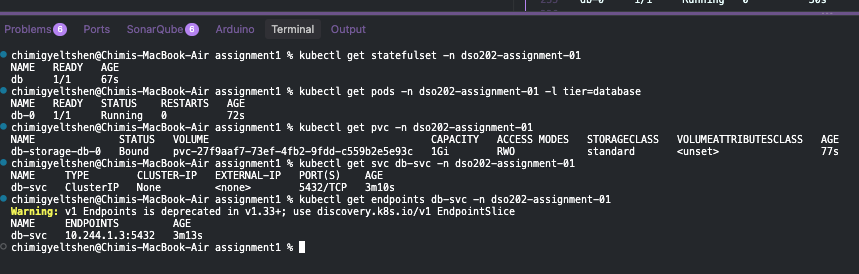

*Figure 12 — StatefulSet `db` is ready, the Pod is named `db-0`, PVC `db-storage-db-0` is `Bound`, and `db-svc` has an endpoint.*

### 4.8 Step 6 — Redeploy the backend and frontend

Backend:

```bash
kubectl apply -f backend/deployment.yaml
kubectl apply -f backend/service.yaml
```

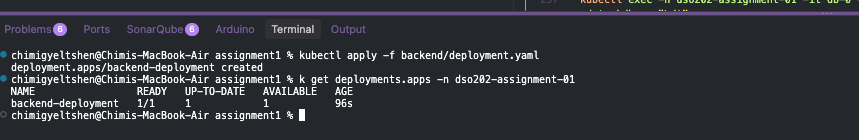

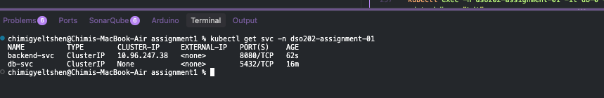

*Figures 13–14 — Backend Deployment and Service created.*

Frontend (still using the Assignment 1 `NodePort` Service at this stage):

```bash
kubectl apply -f frontend/deployment.yaml
kubectl apply -f frontend/service.yaml
```

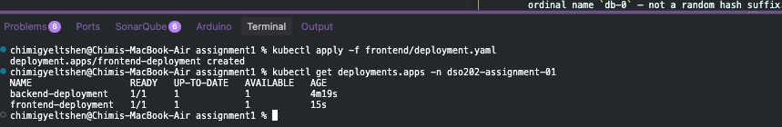

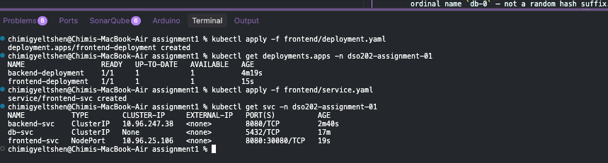

*Figures 15–16 — Frontend Deployment and Service created.*

### 4.9 Step 7 — Verify the database from inside the cluster

```bash
kubectl exec -n dso202-assignment-01 -it db-0 -- psql -U postgres -d taskdb -c "\dt"
```

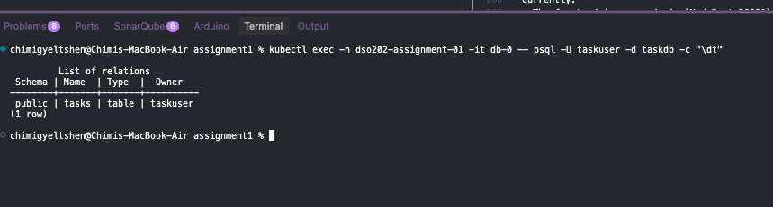

*Figure 17 — The init script ran and the application tables exist in `taskdb` on Pod `db-0`.*

**Part 1 result:** the database now runs as StatefulSet `db` with the stable Pod name `db-0`, a PVC owned through `volumeClaimTemplates`, and a stable DNS name used by the backend.

---

## 5. Part 2 — Ingress with the NGINX Ingress Controller

### 5.1 Why an Ingress

After Part 1:

- The frontend is exposed through `NodePort 30080`, a raw TCP port on the node with no path-based routing and no TLS.
- The browser cannot call `backend-svc:8080`, because cluster-internal DNS names cannot be resolved outside the cluster. This is why Assignment 1 Task 7a had to test the API with `curl` through `kubectl port-forward` instead of the browser.

An **Ingress** is an API object that declares HTTP routing rules (host/path → Service). An **Ingress Controller** (here, NGINX) is the component that reads those rules and actually proxies the traffic. Together they:

- provide a **single entry point** at `http://localhost` (port 80) for the whole application;
- route `/api` to the backend and `/` to the frontend under the same host;
- let the browser call `/api/tasks` as a **relative URL**, so no cluster DNS name is needed and requests are same-origin (no CORS issue);
- provide the basis for adding TLS (`https://`) later.

### 5.2 Planned changes

| Action | File / component |
|---|---|
| **Update** | `cluster/kind-cluster.yaml` — add host port 80/443 mappings and the `ingress-ready=true` node label |
| **Recreate** | The `kind` cluster, so that the new port mappings take effect |
| **Update** | `common-manifests/configmap.yaml` — set `BACKEND_URL` to `""` (empty string) |
| **Update** | `frontend/service.yaml` — change type from `NodePort` to `ClusterIP` |
| **Install** | NGINX Ingress Controller (kind-specific manifest) |
| **Create** | `ingress/ingress.yaml` — the routing rules |

> **Important — the cluster must be recreated.** Port mappings in `kind` can only be set when a cluster is created. Deleting the cluster removes **every** object in it, including the PersistentVolume that holds the database files, so any data added through the application is lost. The manifests on disk are unaffected and are re-applied afterwards; the database schema is recreated by the init script in the database image.

### 5.3 Step 1 — Update the kind cluster configuration

**File: `cluster/kind-cluster.yaml`**

```yaml
kind: Cluster
apiVersion: kind.x-k8s.io/v1alpha4
name: dso202

networking:
  apiServerAddress: "127.0.0.1"
  podSubnet: "10.244.0.0/16"
  serviceSubnet: "10.96.0.0/16"

nodes:
  - role: control-plane
    image: kindest/node:v1.36.1@sha256:3489c7674813ba5d8b1a9977baea8a6e553784dab7b84759d1014dbd78f7ebd5
    kubeadmConfigPatches:
      - |
        kind: InitConfiguration
        nodeRegistration:
          name: control-plane
          kubeletExtraArgs:
            node-labels: "ingress-ready=true"
    extraPortMappings:
      - containerPort: 30080
        hostPort: 30080
        listenAddress: "127.0.0.1"
        protocol: TCP
      - containerPort: 80
        hostPort: 80
        listenAddress: "127.0.0.1"
        protocol: TCP
      - containerPort: 443
        hostPort: 443
        listenAddress: "127.0.0.1"
        protocol: TCP
  - role: worker
    image: kindest/node:v1.36.1@sha256:3489c7674813ba5d8b1a9977baea8a6e553784dab7b84759d1014dbd78f7ebd5
    kubeadmConfigPatches:
      - |
        kind: JoinConfiguration
        nodeRegistration:
          name: worker-node-1
          kubeletExtraArgs:
            node-labels: "dso202/node-role=worker,dso202/node-index=1"
  - role: worker
    image: kindest/node:v1.36.1@sha256:3489c7674813ba5d8b1a9977baea8a6e553784dab7b84759d1014dbd78f7ebd5
    kubeadmConfigPatches:
      - |
        kind: JoinConfiguration
        nodeRegistration:
          name: worker-node-2
          kubeletExtraArgs:
            node-labels: "dso202/node-role=worker,dso202/node-index=2"
```

**Changes from Assignment 1:**

- **`node-labels: "ingress-ready=true"`** on the control-plane node. The kind-specific NGINX Ingress manifest schedules the controller only on a node with this label, which is the node that has ports 80/443 mapped from the host.
- **Two new `extraPortMappings`**: host port 80 → node port 80 and host port 443 → node port 443.
- **Port 30080** is kept for backward compatibility. Once the frontend Service becomes `ClusterIP` (Step 5), nothing listens on it any more, so it can be removed in a future revision.

### 5.4 Step 2 — Recreate the cluster

Delete the existing cluster:

```bash
kind delete cluster --name dso202
```

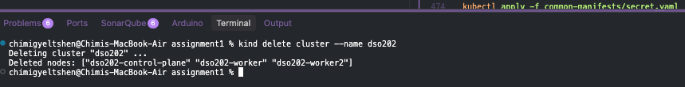

*Figure 18 — Cluster `dso202` deleted.*

Create it again with the updated configuration:

```bash
kind create cluster --config cluster/kind-cluster.yaml
```

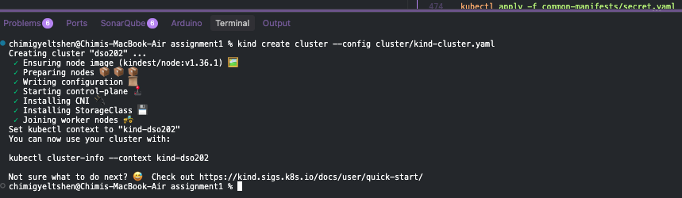

*Figure 19 — Cluster `dso202` created from the new configuration.*

Verify the nodes and the host port mappings:

```bash
kubectl get nodes -o wide
docker ps --format "table {{.Names}}\t{{.Ports}}" | grep dso202
```

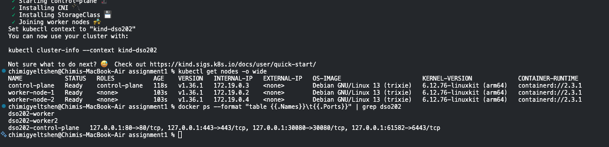

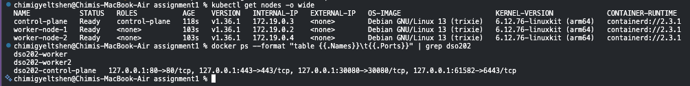

*Figures 20–21 — All three nodes are `Ready`; the control-plane container publishes `127.0.0.1:80`, `127.0.0.1:443` and `127.0.0.1:30080`.*

### 5.5 Step 3 — Update the ConfigMap

The frontend's `app.js` builds the API URL as:

```javascript
const API = `${BACKEND_URL}/api/tasks`;
```

With an Ingress, the frontend (`/`) and the backend (`/api`) are served from the same origin (`http://localhost`). Setting `BACKEND_URL` to an empty string makes API calls relative to the page:

- `"" + "/api/tasks"` → `/api/tasks` → the browser resolves it to `http://localhost/api/tasks`
- The Ingress routes `http://localhost/api/...` to `backend-svc:8080`

This removes the Assignment 1 limitation where the browser could not reach the backend.

**File: `common-manifests/configmap.yaml`** (final version, including the Part 1 change):

```yaml
apiVersion: v1
kind: ConfigMap
metadata:
  name: app-config
  namespace: dso202-assignment-01
  labels:
    app: task-tracker
data:
  DB_HOST: "db-0.db-svc"
  DB_PORT: "5432"
  DB_NAME: "taskdb"
  APP_PORT: "8080"
  CORS_ORIGIN: "*"
  POSTGRES_DB: "taskdb"
  BACKEND_URL: ""                 # was "http://backend-svc:8080"
```

### 5.6 Step 4 — Re-apply the application on the new cluster

Namespace and supporting objects:

```bash
kubectl apply -f common-manifests/namespace.yaml
kubectl apply -f common-manifests/configmap.yaml
kubectl apply -f common-manifests/secret.yaml
kubectl apply -f common-manifests/quota.yaml
```

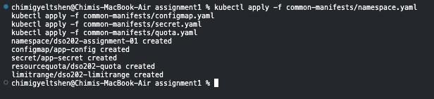

*Figure 22 — Namespace, ConfigMap, Secret and quota objects created.*

Database tier (headless Service + StatefulSet from Part 1):

```bash
kubectl apply -f database/service.yaml
kubectl apply -f database/statefulset.yaml
```

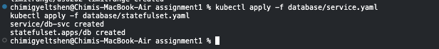

*Figure 23 — Database tier created.*

Backend tier:

```bash
kubectl apply -f backend/deployment.yaml
kubectl apply -f backend/service.yaml
```

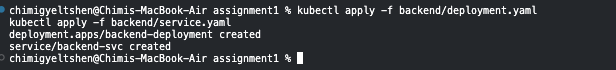

*Figure 24 — Backend tier created.*

### 5.7 Step 5 — Change the frontend Service to ClusterIP

The frontend no longer needs to be reachable directly on a node port: the Ingress Controller receives all external traffic on port 80 and forwards it to the Service inside the cluster.

**File: `frontend/service.yaml`**

```yaml
apiVersion: v1
kind: Service
metadata:
  name: frontend-svc
  namespace: dso202-assignment-01
  labels:
    tier: frontend
spec:
  type: ClusterIP
  selector:
    tier: frontend
  ports:
    - port: 8080
      targetPort: 8080
```

The `nodePort: 30080` field is removed, because a `ClusterIP` Service is not exposed on the nodes.

```bash
kubectl apply -f frontend/deployment.yaml
kubectl apply -f frontend/service.yaml
```

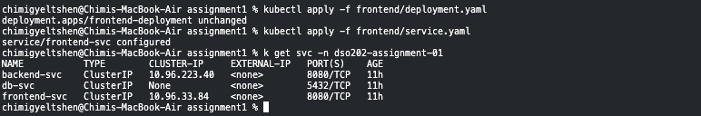

*Figure 25 — Frontend Deployment and `ClusterIP` Service created.*

### 5.8 Step 6 — Make sure the Pods use the updated ConfigMap

`BACKEND_URL` is not read at request time. The frontend container's entrypoint writes it into `config.js` (using `envsubst`) once, when the Pod starts. A Pod that was already running before a ConfigMap change keeps the old value until it is restarted.

On this fresh cluster the ConfigMap was applied before any Pods were created, so the Pods already had the new value. A rollout restart was still performed as a safeguard, since this is the required step whenever the ConfigMap is changed on a running system:

```bash
kubectl rollout restart deployment frontend-deployment -n dso202-assignment-01
kubectl rollout restart deployment backend-deployment -n dso202-assignment-01
```

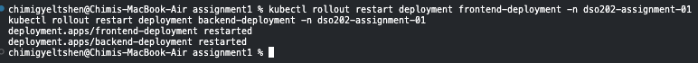

*Figure 26 — Both Deployments restarted.*

```bash
kubectl rollout status deployment frontend-deployment -n dso202-assignment-01
kubectl rollout status deployment backend-deployment -n dso202-assignment-01
```

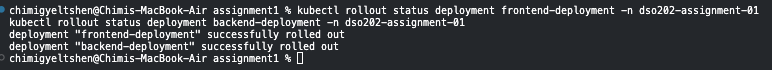

*Figure 27 — Both rollouts completed successfully.*

Confirm that the frontend's generated `config.js` contains the empty `BACKEND_URL`:

```bash
kubectl exec -n dso202-assignment-01 \
  $(kubectl get pod -n dso202-assignment-01 -l tier=frontend -o jsonpath='{.items[0].metadata.name}') \
  -- cat /usr/share/nginx/html/config.js
```

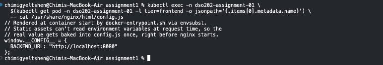

*Figure 28 — `config.js` shows `BACKEND_URL: ""`.*

### 5.9 Step 7 — Install the NGINX Ingress Controller

```bash
kubectl apply -f https://raw.githubusercontent.com/kubernetes/ingress-nginx/main/deploy/static/provider/kind/deploy.yaml
```

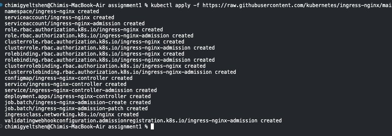

*Figure 29 — NGINX Ingress Controller resources created in the `ingress-nginx` namespace.*

**Why a separate namespace?** The Ingress Controller is cluster infrastructure, not part of the application. It is installed in its own namespace, `ingress-nginx`, and is granted a `ClusterRole` that lets it watch Ingress objects in **every** namespace. When an Ingress is created in `dso202-assignment-01`, the controller detects it and updates its NGINX routing configuration. Keeping it in a separate namespace isolates it from the application's resources and quota.

### 5.10 Step 8 — Create the Ingress resource

**File: `ingress/ingress.yaml`**

```yaml
apiVersion: networking.k8s.io/v1
kind: Ingress
metadata:
  name: task-tracker-ingress
  namespace: dso202-assignment-01
  annotations:
    nginx.ingress.kubernetes.io/proxy-read-timeout: "3600"
    nginx.ingress.kubernetes.io/proxy-send-timeout: "3600"
spec:
  ingressClassName: nginx
  rules:
    - http:
        paths:
          - path: /api
            pathType: Prefix
            backend:
              service:
                name: backend-svc
                port:
                  number: 8080
          - path: /
            pathType: Prefix
            backend:
              service:
                name: frontend-svc
                port:
                  number: 8080
```

**Key fields:**

- **`ingressClassName: nginx`** — selects the Ingress Controller responsible for this Ingress. It must match the `IngressClass` registered by the NGINX controller (`nginx`).
- **No `host`** — the rule applies to any host name, so the application answers on `http://localhost`.
- **`path: /api`, `pathType: Prefix`** — any request whose path starts with `/api` (e.g. `/api/tasks`, `/api/status`) goes to `backend-svc:8080`. The path is forwarded unchanged, which is correct because the Express backend defines its routes under `/api/...`.
- **`path: /`, `pathType: Prefix`** — every other request (`/`, `/index.html`, `/styles.css`, `/app.js`, `/config.js`) goes to `frontend-svc:8080`.
- **Path precedence** — the order of the paths in the YAML does not matter. For `Prefix` matches, the **longest matching path wins**, so `/api/tasks` always matches `/api` rather than `/`.
- **Timeout annotations** — raise the proxy read/send timeouts to one hour, so long-running requests are not cut off at NGINX's 60-second default.

```bash
kubectl apply -f ingress/ingress.yaml
```

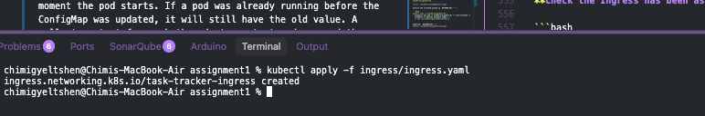

*Figure 30 — `task-tracker-ingress` created.*

Confirm the controller Pod is ready:

```bash
kubectl wait --namespace ingress-nginx \
  --for=condition=ready pod \
  --selector=app.kubernetes.io/component=controller \
  --timeout=90s
```

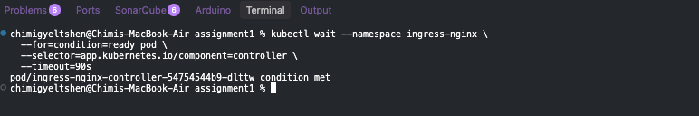

*Figure 31 — The Ingress Controller Pod reports `condition met`.*

### 5.11 Step 9 — Verify

All application objects and the Ingress:

```bash
kubectl get all -n dso202-assignment-01
kubectl get ingress -n dso202-assignment-01
```

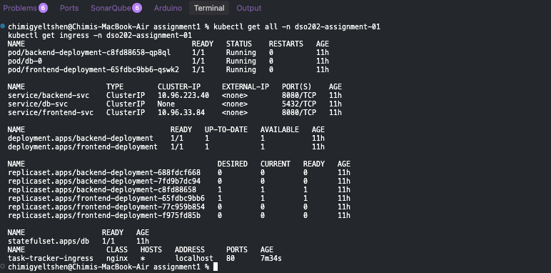

*Figure 32 — StatefulSet `db` (Pod `db-0`), both Deployments, the three Services (frontend now `ClusterIP`) and the Ingress are present.*

Ingress details and backends:

```bash
kubectl describe ingress task-tracker-ingress -n dso202-assignment-01
```

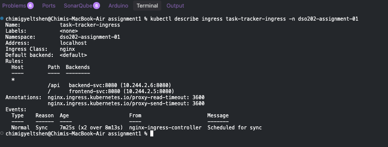

*Figure 33 — `/api` routes to `backend-svc:8080` and `/` to `frontend-svc:8080`, each with a Pod endpoint.*

End-to-end test through the Ingress on port 80:

```bash
curl -s http://localhost/api/status
```

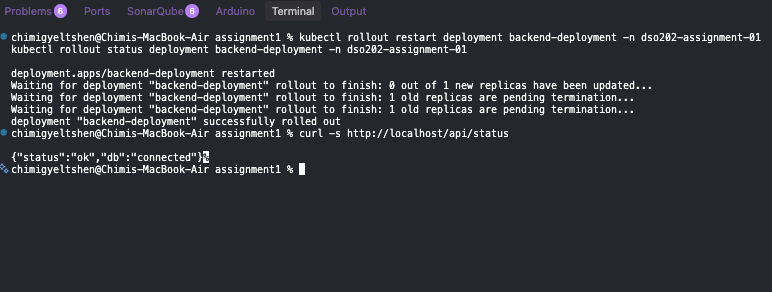

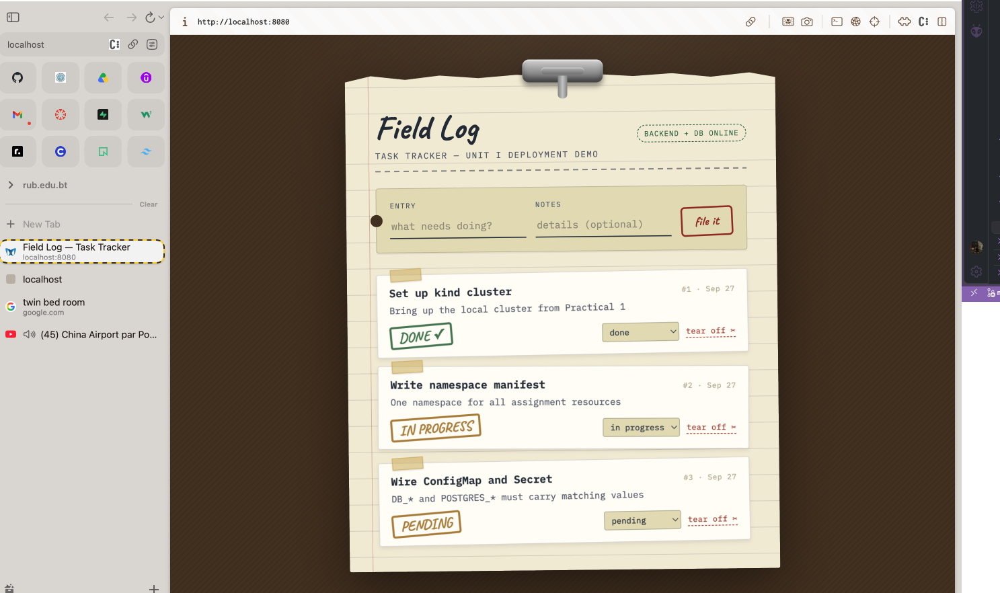

*Figures 34–35 — The backend API and the application respond at `http://localhost`, with no `port-forward` or `NodePort` involved.*

**Part 2 result:** the whole application is served through a single entry point at `http://localhost`. The browser loads the frontend from `/` and calls the backend at `/api/...` on the same origin, which resolves the Assignment 1 limitation.

---

## 6. Summary of Changes

### 6.1 Limitations resolved

| Assignment 1 limitation | Resolution in Assignment 2 |
|---|---|
| Random database Pod name | StatefulSet gives the stable name `db-0` |
| Separately managed database PVC | `volumeClaimTemplates` creates and binds `db-storage-db-0` automatically |
| Frontend only reachable via `NodePort 30080` | Ingress on port 80; frontend Service is now `ClusterIP` |
| Browser cannot reach `backend-svc:8080` | `BACKEND_URL=""` + Ingress route `/api` → same-origin relative calls |
| No single HTTP entry point | One Ingress routes `/` and `/api` under `http://localhost` |

### 6.2 File changes

| File | Change |
|---|---|
| `cluster/kind-cluster.yaml` | Added host ports 80/443 and the `ingress-ready=true` label |
| `common-manifests/configmap.yaml` | `DB_HOST: "db-0.db-svc"`, `BACKEND_URL: ""` |
| `database/statefulset.yaml` | **New** — StatefulSet `db` with `volumeClaimTemplates` |
| `database/deployment.yaml` | Retired — no longer applied |
| `database/pvc.yaml` | Retired — no longer applied |
| `database/service.yaml` | Unchanged (headless Service, used as `serviceName`) |
| `frontend/service.yaml` | `NodePort` → `ClusterIP` |
| `ingress/ingress.yaml` | **New** — routes `/api` → backend, `/` → frontend |

### 6.3 Final apply order

```bash
kind create cluster --config cluster/kind-cluster.yaml

kubectl apply -f common-manifests/namespace.yaml
kubectl apply -f common-manifests/configmap.yaml
kubectl apply -f common-manifests/secret.yaml
kubectl apply -f common-manifests/quota.yaml

kubectl apply -f database/service.yaml
kubectl apply -f database/statefulset.yaml

kubectl apply -f backend/deployment.yaml
kubectl apply -f backend/service.yaml

kubectl apply -f frontend/deployment.yaml
kubectl apply -f frontend/service.yaml

kubectl apply -f https://raw.githubusercontent.com/kubernetes/ingress-nginx/main/deploy/static/provider/kind/deploy.yaml
kubectl wait -n ingress-nginx --for=condition=ready pod \
  --selector=app.kubernetes.io/component=controller --timeout=90s

kubectl apply -f ingress/ingress.yaml
```

Waiting for the controller before applying the Ingress avoids a possible rejection by the controller's admission webhook while it is still starting.

---

## 7. Observations and Future Work

- **Local cluster state is not durable.** Section 3 showed that a `kind` cluster can lose its objects when Docker is restarted, and Part 2 required deliberately deleting the cluster. Keeping every object as a version-controlled manifest made full recovery a matter of re-running `kubectl apply`. Database *contents*, however, are not in the manifests; a backup (e.g. `pg_dump`) would be needed to preserve them.
- **Pin the controller version.** The controller was installed from the `main` branch URL, which can change at any time. For reproducible results, the manifest should be referenced by a release tag.
- **Ingress NGINX status.** The Kubernetes project announced the retirement of the community `ingress-nginx` controller (best-effort maintenance ended in March 2026), and the Gateway API is the recommended successor. It works for this assignment, but a migration to a Gateway API implementation would be the natural next step.
- **Clean-up.** Port mapping 30080 and the retired `database/deployment.yaml` and `database/pvc.yaml` files can be removed.
- **TLS.** With port 443 already mapped, HTTPS can be added by creating a TLS Secret and a `tls:` section in the Ingress.